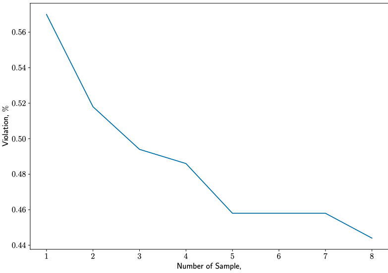
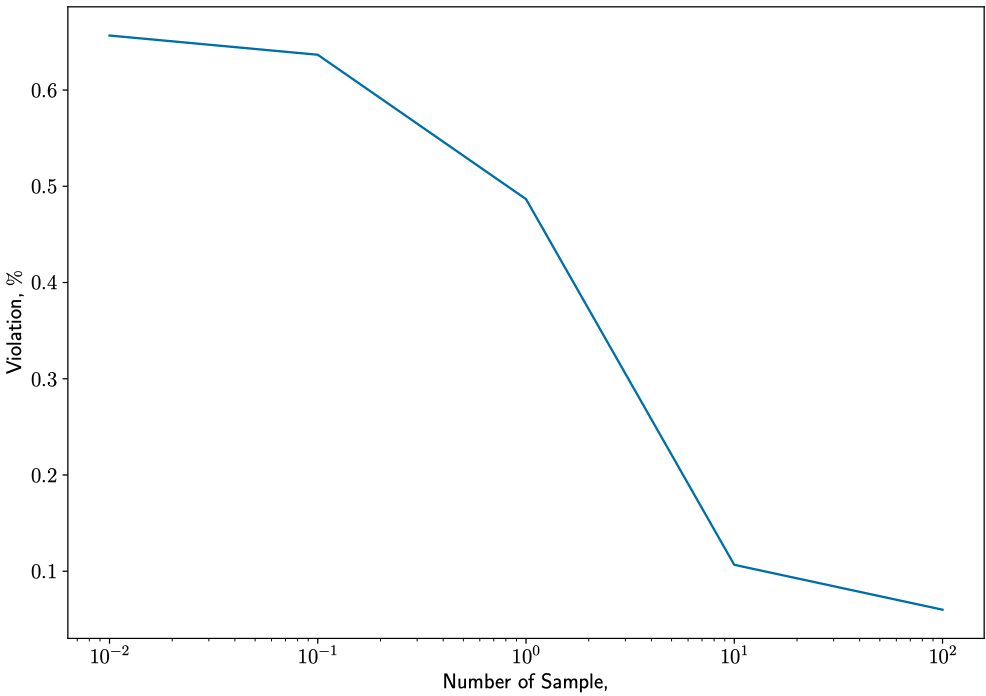
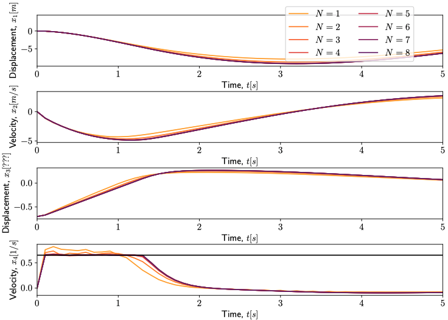
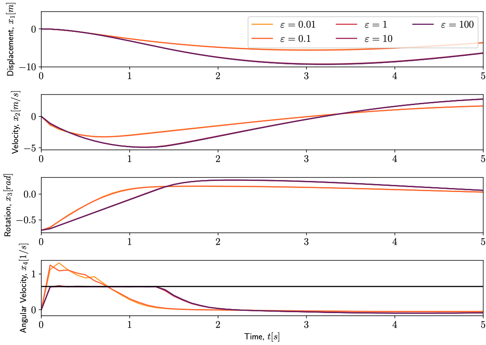

# Nonlinear_tracking_DRMPC

1. Implement on the nonlinear system "inverted pendulum"

   1. Reduced Violation as the number of samples increases

      

   2. Reduced Violation as the ball radius increases

      

   3. Trajectories of different numbers of samples

      

   4. Trajectories of different ball radii

      

